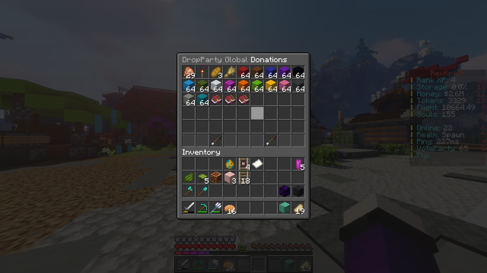
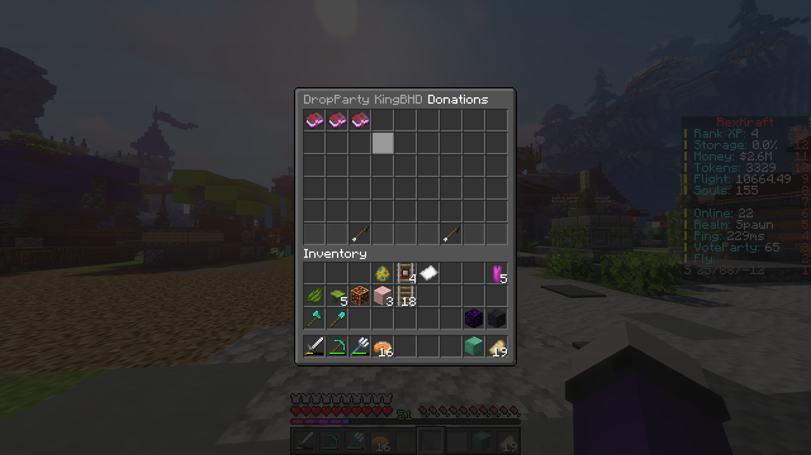

The ultimate solution for server owners looking to host exhilarating drop-parties for their players! With Dropparty
Plugin, you can effortlessly organize and execute drop-parties on your server, adding an extra layer of
excitement to your community events.

- To utilize the plugin, follow these simple steps:
    - **Installation:** Place the `.jar` file in your plugin folder and restart your server to enable the plugin.
    - **Setting Party Location:** Stand on the desired block where you want the dropparty event to start and execute
      `/dropparty set`.
    - **Player Permissions:** Ensure that players have the `dropparty.player` permission to donate items for the party.
    - **Initiating the Event:** Run `/dropparty start` to kick off the dropparty event and let the festivities begin!

_This plugin still in development phase, Please leave me lots of feedback and bugs, so I can fix/add them. :)_


- **Easy Event Management:** Using the /dropparty command, players can donate random or custom items towards the drop
  party. These contributions are seamlessly saved in the database for admins to manage.

- **Flexible Start Options:** Admins have the flexibility to initiate the drop party event whenever they desire, either
  through the convenient /dropparty start command or via console, ensuring full control over the timing and execution.

- **Item Donation Tracking:** Utilize the /dropparty show command to display all donated items from all players,
  providing transparency and insight into the items collected for the drop party. Additionally, with the dropparty
  show <username> command, admins can view specific player contributions, enabling targeted oversight and recognition.


```text
/dropparty - Donate items for the party.
/dropparty help - Get command assistance.
/dropparty start -Begin the party.
/dropparty show [player] - Display donations.
/dropparty cancel - Stop the party prematurely.
/dropparty reset - Clear all donations and reset.
/dropparty set - Define party location.
```


Dropparty only has two basic permissions, one for player and other for admin

```text
dropparty.admin - To run the admin commands
dropparty.player - To allow players to donate
```


- _Player donating items to `/dropparty`_


- _Admin initiating `/dropparty start` event_



- _Admin command `/dropparty show`_



- _Admin command `/dropparty show KingBHD`_


If you encounter any issues or have questions about the Dropparty Plugin, feel free to reach out for support.
Discord: @kingbhd

If you find this plugin helpful and would like to support its development, consider buying me a coffee! Your support is
greatly appreciated.
[Buy Me a Coffee](https://www.buymeacoffee.com/KingBHD)

> "Every party is an opportunity to create a cherished memory." - Robert Rivers
